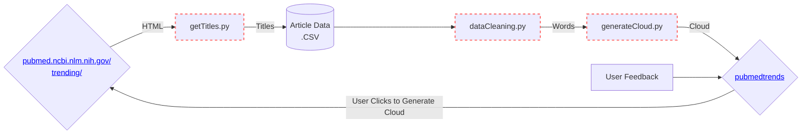

# Project Description
pubmedtrends.com succinctly describes the trends in medical literature. A simple word cloud appears on the website that shows the most frequently used words in the top trending articles on PubMed. A user may generate an updated word cloud at any time.
# Instructions to emulate website on local server
1. Clone this repository
2. Install and update any dependencies outlined in "server.py"
3. Run "server.py"
4. Go to any browser and type in 127.0.0.1:5000 as the url (This is the default location of the python flask local server)
# Process
1. HTML is taken from PubMed's trending webpages using the Python requests library
2. Titles from the trending articles are scraped from the HTML using Beautifulsoup 
3. Titles are cleaned using regular expressions and converted into a list of words
4. A word cloud is generated from the list of words and is rendered on the website

Example of a wordcloud:

