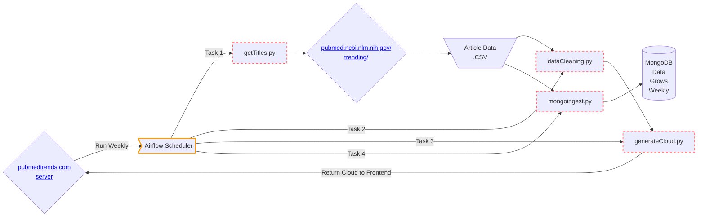

# Table of Contents 
1. [Introduction and Project Description](README.md#Introduction%20and%20Project%20Description)
2. [Example Visualization](README.md#Example%20Visualization)
3. [Data Pipeline and Tools Used](README.md#Data%20Pipeline%20and%20Tools%20Used)
# Introduction and Project Description
- pubmedtrends.com succinctly describes the trends in medical literature. 
- A word cloud on the website ranks the most frequently used words in the top 1000 trending articles on PubMed. 
- A new cloud is automatically generated and posted to the website every week.
- Users can look through past clouds to view how the trends have shifted over time. 
- This project incorporates various aspects of the data lifecycle including data ETL, analysis, visualization, and project deployment.
# Example Visualization:

# Data Pipeline and Tools Used
**General Overview**

This project 

1. HTML is taken from PubMed's trending webpages using the Python requests library
2. Titles from the trending articles are scraped from the HTML using Beautifulsoup 
3. Titles are cleaned using regular expressions and converted into a list of words
4. A word cloud is generated from the list of words and is rendered on the website

**Below is a Mermaid diagram of the pipeline**

