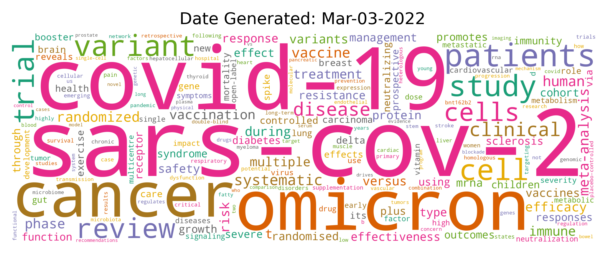

# Table of Contents 
1. [Introduction and Project Description](#Introduction%20and%20Project%20Description)
2. [Example Visualization](#Example%20Visualization)
3. [Data Pipeline and Tools Used](#Data%20Pipeline%20and%20Tools%20Used)
4. [Deployment Process](#Deployment%20Process)
# Introduction and Project Description
- [pubmedtrends.com](https://pubmedtrends.com/) succinctly describes the trends in medical literature. 
- A word cloud on the website ranks the most frequently used words in the top 1000 trending articles on [PubMed.gov](https://pubmed.ncbi.nlm.nih.gov/trending/). 
- A new cloud is automatically generated and posted to the website every week.
- Users can look through past clouds to view how the trends have shifted over time. 
- This project incorporates various aspects of the data lifecycle including data ETL, analysis, visualization, and project deployment.
# Example Visualization:

# Data Pipeline and Tools Used
This project's data pipeline involves several steps:

## Step 1

An Apache Airflow DAG is set to run weekly with each individial task being a single-threaded python script.

--**Step 2**

A webscraper returns HTML from [PubMed's](https://pubmed.ncbi.nlm.nih.gov/trending/) first 100 trending webpages using the Python requests library. The HTML files are parsed using beatifulsoup and information about each trending article's title, authors, and journal citations are written to a csv file.

**Example Scraped Data**
| Title                  | Authors                  | Journal/Citation            |
|:-----------------------|:-------------------------|:----------------------------|
|Ribosome accumulation during early phase resistance training in humans.|Hammarström D, Øfsteng SJ, Jacobsen NB, Flobergseter KB, Rønnestad BR, Ellefsen S.|Acta Physiol (Oxf). 2022 Feb 25:e13806. doi: 10.1111/apha.13806. Online ahead of print.|
|Phosphate, pyrophosphate, and vascular calcification: a question of balance.|Villa-Bellosta R, Egido J.|Eur Heart J. 2017 Jun 14;38(23):1801-1804. doi: 10.1093/eurheartj/ehv605.|     
|Mucosal fungi promote gut barrier function and social behavior via Type 17 immunity.|Leonardi I, Gao IH, Lin WY, Allen M, Li XV, Fiers WD, De Celie MB, Putzel GG, Yantiss RK, Johncilla M, Colak D, Iliev ID.|Cell. 2022 Feb 16:S0092-8674(22)00075-7. doi: 10.1016/j.cell.2022.01.017. Online ahead of print.|
| Continued...                    |Continued...                       |Continued...                         |

--**Step 3**

The scraped titles are seperated into individual words and are then cleaned using regular expressions. This step insures that the words are not exclusively numeric and any  extraneous special characters are removed.

--**Step 4**

A word cloud is generated using the cleaned words and a date of creation is posted above the cloud for user reference.

--**Step 5**

The scraped article data is loaded into MongoDB to build a dataset that may be used in the future for analysis. A new MongoDB collection is created for each date the pipeline is run.

**A Mermaid diagram of the pipeline is shown below:**

# Deployment Process
This project was deployed using a single [AWS EC2](https://aws.amazon.com/ec2/) instance with the following tools and components:
- A [Python Flask](https://flask.palletsprojects.com/en/2.0.x/) server to create the website ([HTML](https://en.wikipedia.org/wiki/HTML) & [CSS](https://en.wikipedia.org/wiki/CSS) as the frontend)
- A [NginX](https://www.nginx.com/) server used as a reverse proxy (Used [Python Certbot](https://pypi.org/project/certbot/) for HTTPS)
- An [Airflow](https://airflow.apache.org/) scheduler
- A [MongoDB](https://www.mongodb.com/) server
